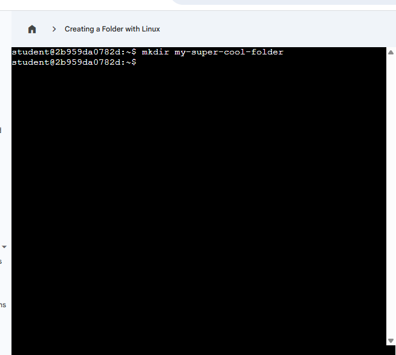

# Module 3: Operating Systems and You – Becoming a Power User

**Status:** ✅ Completed – April 2026

**Key Learnings:**
- Command Line on Linux and Windows
- Creating and managing folders
- Basic file system navigation

**Screenshots:**

