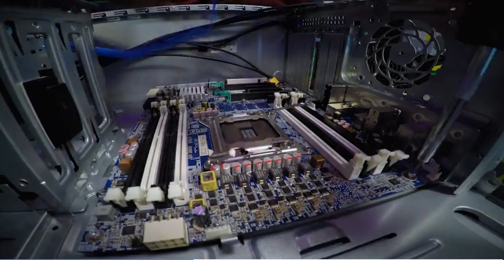
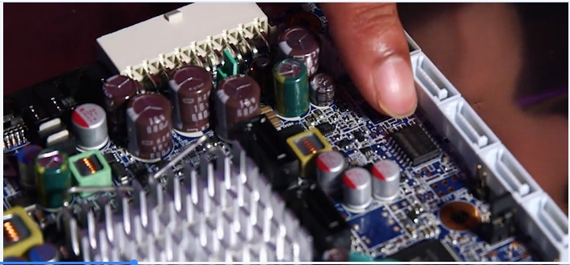
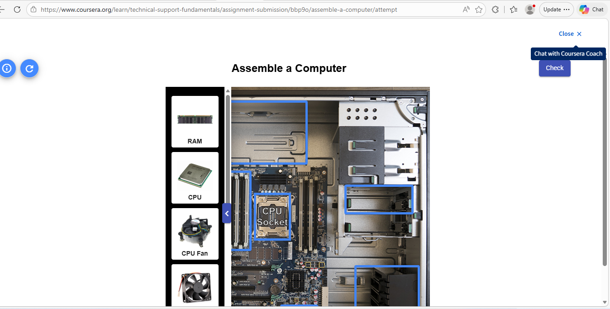
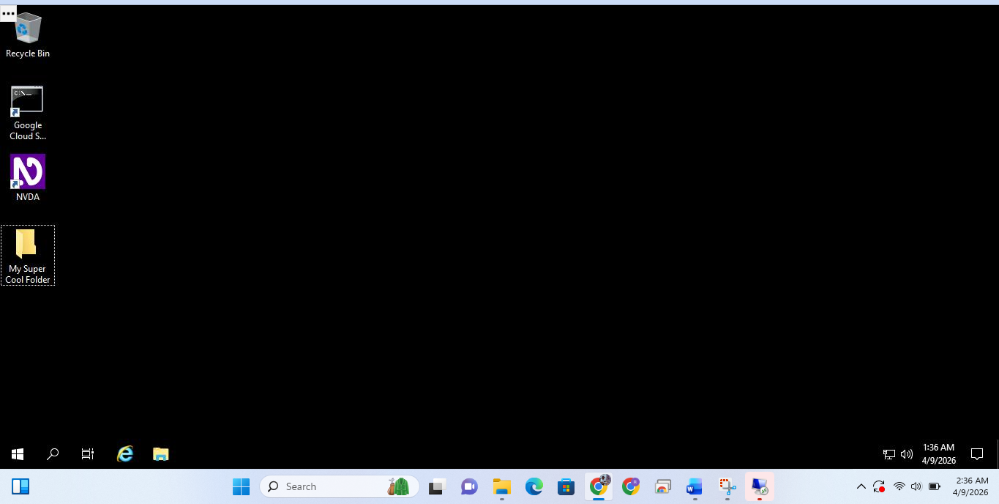

# Google IT Support Professional Certificate Portfolio

**Igbinosa**  
Customer Support Specialist @ Teleperformance Nigeria (Remote 8 am - 5 pm)
Pivoting to IT Support / Helpdesk roles in Lagos by August 2026

Currently completing the **Google IT Support Professional Certificate** on Coursera (almost finished Module 2).

## Current Progress
- **Course 1: Technical Support Fundamentals** – Almost complete  
  • Hardware components (CPU, RAM, storage, motherboards, peripherals)  
  • BIOS/UEFI configuration, boot order, Secure Boot, CMOS troubleshooting

## Portfolio Projects (Adding weekly)
(First screenshots & write-ups uploading tonight)

## Goal
Become one of the strongest entry-to-mid-level IT Support Specialists in Nigeria by August 2026.

Skills in progress: Hardware diagnostics, BIOS troubleshooting, Networking, OS, Security, Scripting.
  
Connect:  
X: @Rufusmarch  
LinkedIn: https://www.linkedin.com/in/success-igbinosa-a45852254/ 

## Projects & Labs

### Hardware Identification & Troubleshooting
- Simulated PC component checks: Identified roles of CPU (processing), RAM (temporary memory), storage (HDD/SSD for data), and peripherals.  
- Basic diagnostics: Checked compatibility and potential failure points.

### BIOS/UEFI Configuration Labs
- Navigated BIOS menus to adjust boot order and enable Secure Boot for security.  
- Troubleshot simulated boot issues (e.g., wrong boot device priority, CMOS reset basics).

Embedded Module 2 screenshots in README for visual portfolio

## Current Progress (Updated March 24, 2026)

- **Course 1: Technical Support Fundamentals**  
  • Module 2 ✅ Completed  
    - Hardware components  
    - BIOS/UEFI configuration  
    - Peripherals, printers, mobile devices    

- **Next up:** Module 3 – Operating Systems

## Recent Additions to Portfolio
- New screenshots and lab notes from Module 2 

## Current Progress
- **Module 3: Operating Systems and You – Becoming a Power User** → ✅ **Completed** (April 2026)
- Currently in: **Module 4 – System Administration and IT Infrastructure Services**

## Skills Gained So Far
- Technical troubleshooting & clear customer communication
- Networking fundamentals (TCP/IP, DNS, subnetting)
- Operating Systems (Windows & Linux): Command Line tools, file management, user permissions

# Module 3: Operating Systems and You – Becoming a Power User

**Status:** ✅ Completed – April 2026

**Key Learnings:**
- Command Line navigation on Linux and Windows
- Creating and managing folders/directories
- Basic file system organization

**Qwiklabs Screenshots:**

