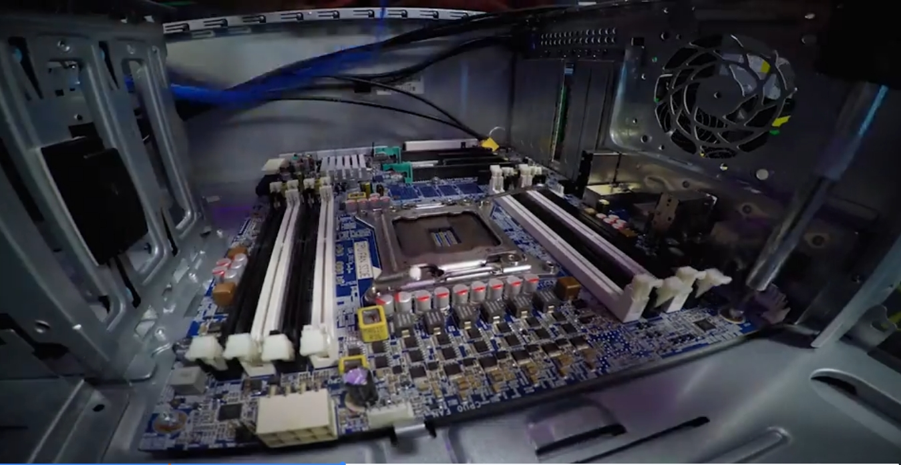
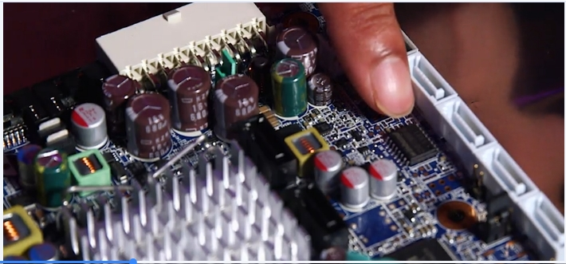
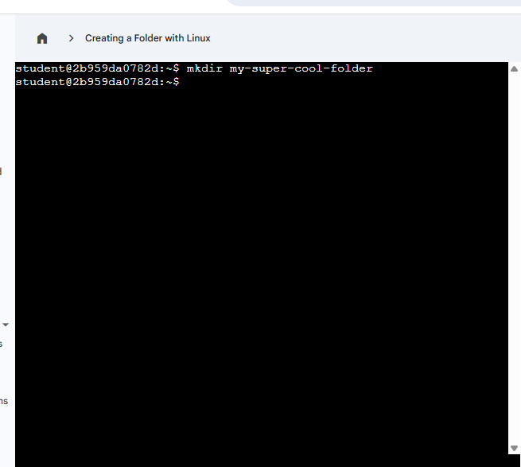
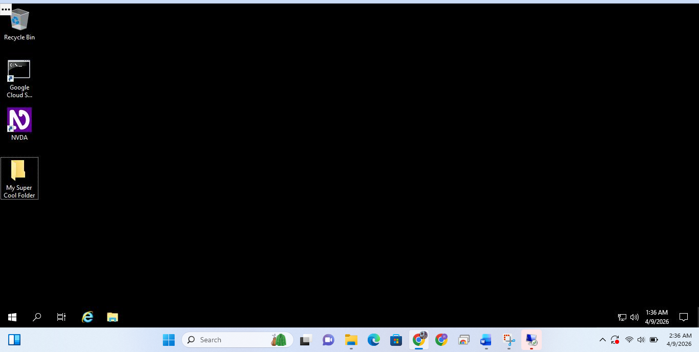

# Google IT Support Professional Certificate — Portfolio

**Name:** Success Igbinosa
**Current Role:** Customer Support Specialist (Remote)
**Goal:** Transition into an IT Support / Technical Support role

I'm a Customer Support Specialist with 5+ years of experience across banking, e-commerce, telecommunications, and security systems, currently building formal technical skills through the Google IT Support Professional Certificate on Coursera. This repository documents that progress honestly, course by course, with hands-on labs and projects as I complete them.

## Certificate Progress

| Course | Status |
|---|---|
| 1. Technical Support Fundamentals | ✅ Completed |
| 2. The Bits and Bytes of Computer Networking | ✅ Completed |
| 3. Operating Systems and You: Becoming a Power User | ⬜ Not Started |
| 4. System Administration and IT Infrastructure Services | ⬜ Not Started |
| 5. IT Security: Defense Against the Digital Dark Arts | ⬜ Not Started |

*Last updated: August 2026*

## Skills Gained So Far

- Computer hardware fundamentals: CPU, RAM, storage, motherboards, peripherals
- BIOS/UEFI configuration: boot order, Secure Boot, basic CMOS troubleshooting
- Basic OS navigation concepts (Windows & Linux)
- Networking fundamentals: TCP/IP, DNS, subnetting, IP addressing, connectivity troubleshooting

## Course 1: Technical Support Fundamentals

**Status:** ✅ Completed

**Key Learnings:**
- Identifying and understanding the role of core hardware components (CPU, RAM, storage, peripherals)
- BIOS/UEFI configuration and troubleshooting boot order issues
- Basic OS navigation and file management concepts

**Labs & Screenshots:**

## Course 2: The Bits and Bytes of Computer Networking

**Status:** ✅ Completed

**Key Learnings:**
- TCP/IP fundamentals and how devices communicate on a network
- DNS and how domain names resolve to IP addresses
- Subnetting and IP addressing
- Basic connectivity troubleshooting (ping, traceroute, ipconfig)

**Project:** [Home Network Diagram & Documentation](./projects/network-diagram) — a diagram of my own home network with subnetting, DHCP, and DNS explained in my own words, plus a real troubleshooting log using `ping`, `tracert`, and `ipconfig`.

*(Project folder and diagram to be added — see next steps below.)*

## Course 3: Operating Systems and You

**Status:** ⬜ Not started yet.

## Course 4: System Administration and IT Infrastructure Services

**Status:** ⬜ Not started yet.

## Course 5: IT Security: Defense Against the Digital Dark Arts

**Status:** ⬜ Not started yet.

## Connect

- LinkedIn: [linkedin.com/in/success-igbinosa-a45852254](https://www.linkedin.com/in/success-igbinosa-a45852254/)
  

