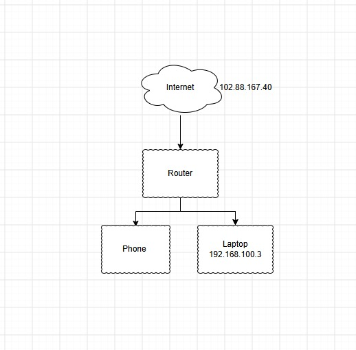

# Home Network Diagram & Documentation

## What this project shows
A basic diagram of my home network, along with an explanation of core networking concepts I'm learning in the Google IT Support Professional Certificate (Networking module).

## Diagram

## What I learned
- **Local IP address:** identifies a device within my home network, assigned automatically by my router via DHCP.
- **Public IP address:** identifies my entire home network to the wider internet, shared by all devices behind the router.
- **Router:** connects my home network to the internet and assigns local IP addresses to each connected device.
- **DHCP:** the system that automatically assigns local IP addresses so I don't have to set them manually.

## Why this matters for IT support
Understanding local vs. public IPs and how a router assigns addresses is foundational for troubleshooting connectivity issues, one of the most common first-line IT support tickets.
